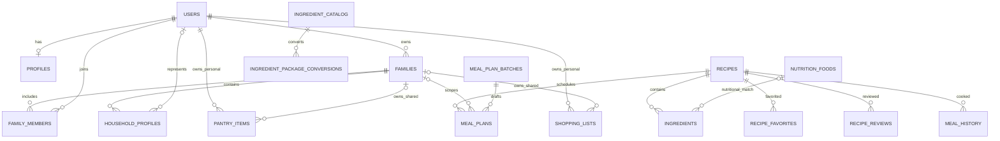

# WhatToCook ERD

The visual ERD is retained as [capstone erd.jpg](../capstone%20erd.jpg). This source-level ERD records the Phase 6 deliverable schema and is easier to review alongside migrations.

Important boundaries: a family membership is a registered account relationship, while a household profile represents any diner, including a child without a login. Pantry, plans, and shopping records carry either personal ownership or family scope; API authorization enforces that boundary.
